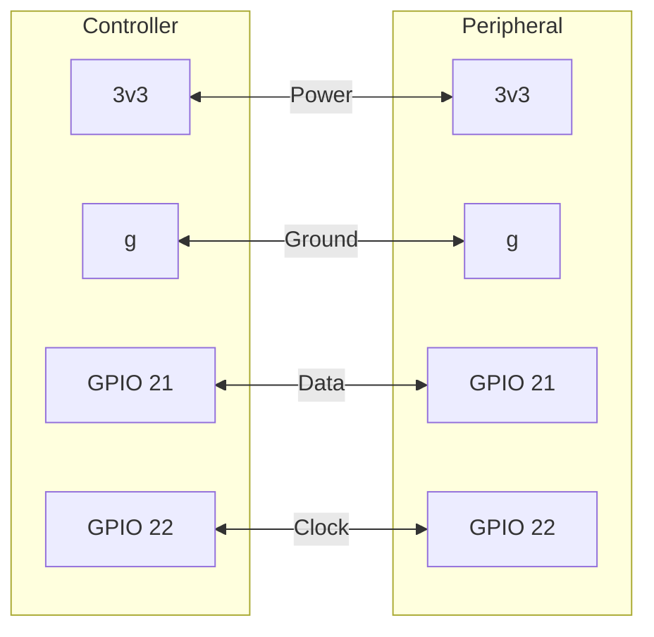

# Ecobee Experiments

This is a sandbox for hardware experiments with ecobee thermostats

```mermaid
graph RL
    subgraph Controller
        C3v3[3v3]
        Cg[g]
        C21[GPIO 21]
        C22[GPIO 22]
    end
    subgraph Peripheral
        P3v3[3v3] <--> |Power| C3v3
        Pg[g] <--> |Ground| Cg
        P21[GPIO 21] <--> |Data| C21
        P22[GPIO 22] <--> |Clock| C22
    end
```
